# 🐍 snake686

> — Джон, ты уверен, что готов к этому?  
>   Оно действует не самым безопасным методом,  
>   Последний, кто пробовал это, попал в дурдом.  
> — Да он слабак! Давай начнём, чего мы ждём!  
> [(Карандаш feat. Noize MC, "Hellp")](https://music.yandex.ru/album/989973/track/9352607)

<p align="center">
  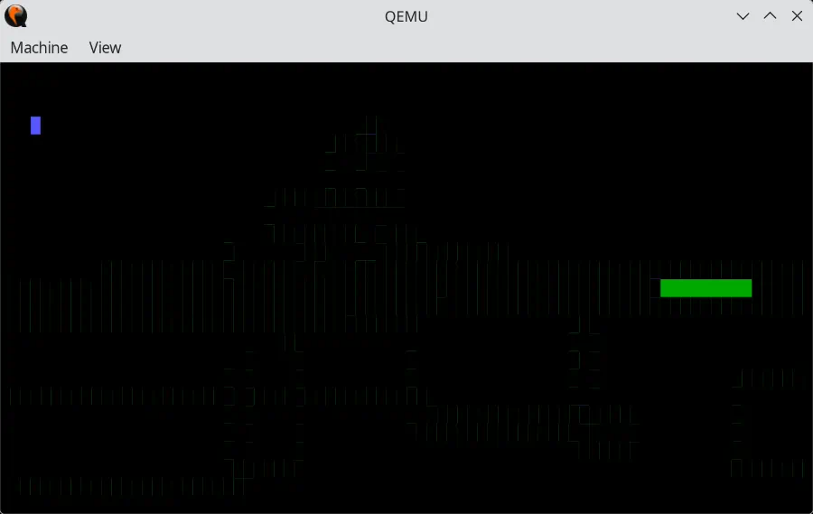
</p>

## What is this?

This is the funniest, smallest and absurd bare-metal snake game **in the world**, written in Rust!  
Have fun, guys!

## What is this REALLY?

Ok, I mean, it was really written just for lulz in a discussion on [wasm.in](https://www.wasm.in/threads/zabavnye-novosti-0j-ti.32771/page-49#post-441055),
but has grown into something like a handbook about the first steps
in x86 bare metal, real and protected modes.  
And, at the same time, it is a demo of building bare-metal applications in Rust.

And more, here we bring some light into a bad-documented area of
x86 internals like IO-ports or legacy interrupts that are
partially documented in sites like [wiki.osdev.org](https://wiki.osdev.org),
but that is perceived like a magic without explanation of where it comes from,
in a manner of "just do as written".

So, we found origins of all roots and documented **every port** and **every bit**
with the links to the exact hardware specifications.

## Here we will

* Start in 16-bit Real Mode.
* Make the VGA shine.
* Switch to 32-bit Protected Mode.
* Setup GDT and IDT.
* Remap interrupts via reprogramming of PIC.
* Handle ISRs from a keyboard and timer.
* Write a snake game in Rust.
* Make all of these in **less than 512 bytes** to fit in a bootsector.

## Disclaimer

1. 🌱 **100% organic**: everything was invented, written and documented entirely by hands.  
   Even this readme! Even that huge comments!  
   This project is completely, not, **totally AI-free**.
2. English is not my native language, so, sorry for possible mistakes ❤️

## Table of content

* [Prerequisities](#prerequisities)
* [🦀 In Rust we trust](#in-rust-we-trust)
* [💾 Das boot](#das-boot)
* [🍂 16-bit Real Mode: farewell to the past](#16-bit-real-mode)
  * [Memory model](#16-bit-memory-model)
  * [Memory layout](#16-bit-memory-layout)
  * [Interrupts](#16-bit-interrupts)
  * [BIOS](#16-bit-bios)
    * [Why interrupts?](#16-bit-why-interrupts)
    * [Interrupt overlapping](#16-bit-interrupt-overlapping)
  * [VGA](#16-bit-vga)
  * [Chipset, Hardware & Peripherals](#16-bit-chipset)
  * [I/O Ports](#16-bit-io-ports)
  * [External interrupts](#16-bit-external-interrupts)
  * [Timer](#16-bit-timer)
  * [Keyboard](#16-bit-keyboard)
* [🥱 Too long, didn't read. Let's code!](#tldr)
  * [Switch to nightly](#switch-to-nightly)
  * [Create a target spec](#create-a-target-spec)
* [☀️ First light](#first-light)
  * [Hello, 16-bit world!](#hello-16-bit-world)
  * [Linker script](#linker-script)
  * [Building a bootsector](#building-a-bootsector)
  * [Lock and load!](#lock-and-load)
  * [What's wrong with that?](#whats-wrong)
* [🍃 32-bit Protected Mode](#32-bit-protected-mode)
  * [Segments & Descriptor tables](#32-bit-segments)
  * [Memory model](#32-bit-memory-model)
  * [Interrupts](#32-bit-interrupts)
  * [External interrupts](#32-bit-external-interrupts)
  * [IRQ remapping](#32-bit-irq-remapping)
  * [Switching to Protected Mode](#32-bit-switching-to-protected-mode)
  * [BIOS that we lost](#32-bit-bios-that-we-lost)
* [😴 ...But what about snake?..](#what-about-snake)
  * [Remember - no constants](#remember-no-constants)
  * [Victory costs](#victory-costs)
* [What's next?](#whats-next)
* [🌙 Afterwords](#afterwords) 

## <a id="prerequisities"></a> Prerequisities

* Linux machine or Windows WSL as we need some of Linux binutils to craft a boot-sector.
* QEMU to test our snake.
* Rust compiler (we use a nightly branch).

Also, you need a bunch of specifications to understand the underlying magic:
* [Intel Software Developer's Manual](https://www.intel.com/content/www/us/en/developer/articles/technical/intel-sdm.html) - Intel CPU specification, also known as Intel SDM.
* [Intel Platform Controller Hub (PCH)](https://www.intel.com/content/www/us/en/search.html#q=platform%20controller%20hub&cf-tabfilter=Developers) - Intel chipset specification.
* [AMD Architecture Programmer's Manual](https://docs.amd.com/search/all?query=architecture+programmer%27s+manual&content-lang=en-US) - AMD CPU specification, also known as AMD APM.
* [AMD Processor Programming Reference](https://docs.amd.com/search/all?query=processor+programming+reference&content-lang=en-US) - AMD chipset specification, also known as AMD PPR.
* [Intel 8042 Datasheet](https://theretroweb.com/chips/558) - Keyboard controller.
* [Intel 8254 Datasheet](https://www.alldatasheet.com/datasheet-pdf/pdf/66099/INTEL/8254.html) - Programmable Interval Timer (PIT).
* [Intel 8259A Datasheet](https://www.alldatasheet.com/datasheet-pdf/pdf/66107/INTEL/8259A.html) - Programmable Interrupt Controller (PIC).
* [IBM PC/AT Techical Reference](https://bitsavers.trailing-edge.com/pdf/ibm/pc/at/) - Specification for old good IBM PCs.
* [IBM PS/2 and BIOS Interface Technical Reference](https://archive.org/details/bitsavers_ibmpcps2PSTechnicalReferenceApr87_5816663) - Specification for BIOS (like its interrupts) of IBM PCs.
* [IBM VGA XGA Technical Reference Manual](https://archive.org/details/bitsavers_ibmpccardseferenceManualMay92_1756350/page/n3/mode/2up) - Specification for VGA (like its ports).

## <a id="in-rust-we-trust"></a> 🦀 In Rust we trust

Well, why Rust?  
In short, because we can!

We can write anything in pure assembly, and there are many
projects that implement games in a boot sector:
* [Boot Sector Games](https://gist.github.com/XlogicX/8204cf17c432cc2b968d138eb639494e)

But man!  
Let's bring some fun into this swamp!

What if we don't have full control over the final code?  
Also, we can write such stuff in C and C++, but that will be easier due to
their unsafe nature: no runtime checks, no constraints, it would be boring.

So, Rust is a way to go!

## <a id="das-boot"></a> 💾 Das boot

> We only consider legacy boot process that was on legacy non-UEFI systems.  
> Modern UEFI does the same things under the hood, hiding them from us.  
> The legacy boot can be emulated via UEFI CSM mode.  

After the initialization of hardware, BIOS transfers control
to the boot sector in the first 512 bytes of the boot drive.  
This is the first point where the user code gets control.

The boot sector has 510 bytes for user-defined code and data,
and the last 2 bytes are reserved for the signature `0xAA55`.
BIOS checks this signature on the boot drive and, if it is
presented, loads the whole sector into memory at address `0x7C00`
and transfers control to its beginning.

This boot sector is called [**Master Boot Record**](https://en.wikipedia.org/wiki/Master_boot_record).

## <a id="16-bit-real-mode"></a> 🍂 16-bit Real Mode: farewell to the past

The execution begins in 16-bit Real Mode.

### <a id="16-bit-memory-model"></a> Memory model

In this mode, by default, we have a 20-bit physical address space
that allows us to address 1 MiB of memory.  

> 20-bit width is came from i8086 that has exactly this memory bus width.  
> Then, in Intel 80286, Intel expanded the bus to 24-bit supporting up
> to 16 MiB of physical memory.  
> And then, in Intel 80386, the memory bus was expanded to 32-bit thereby
> supporting up to 4 GiB of physical memory.

A pointer consists of two parts: a 16-bit segment number and a 16-bit offset within it.  
Each segment starts on a 16-byte boundary and has 64 KiB in size.  
The segment number is specified in the special 16-bit segment registers:
* `cs` - code segment.
* `ds` - data segment.
* `ss` - stack segment.
* `es`, `fs` and `gs` - general purpose data-segments.

A final physical address is calculated as `segment index * 16 + offset`.

So that, we can address `0xFFFF * 16 + 0xFFFF` bytes of memory.  
It's a bit more than 1 MiB, but as hardware has the only 20-bit
address bus, the addresses above `0xfffff` will be wrapped around to zero.

```x86asm
mov ax, 0xB8000 / 16  ; Segment number
mov es, ax
mov byte ptr es:[0x100], 'A'  ; Write 'A' to 0xB8100.
```

The available physical address space can be expanded to the width
native for the CPU via enabling [A20-line](https://en.wikipedia.org/wiki/A20_line):
the 21st bit in memory bus that is disabled by default for compatibility
with old 8086 processors.

> In fact, the CPU always works with its native address bus width.  
> For modern CPUs, it is 52 bits (4 TiB) for the CPUs with the support of 5-level paging.  
> With A20-line disabled, the only this bit in bus will always be zero,
> but all other bits (even those above this one) remain active.

In pseudocode, an arbitrary address will be calculated as the following:
```
mov seg:[offset], value

LinearAddr  := (seg * 16) + offset
A20_enabled := 1 (true) or 0 (false)
AddrOnBus   := LinearAddr & ~((not A20_enabled) << 20)
```

### <a id="16-bit-memory-layout"></a> Memory layout

After receiving execution from BIOS, we already have some regions in memory
reserved for BIOS and hardware.  
These regions are always located at fixed addresses that were claimed and
standartized by IBM.

You can find the memory maps here:
* [IBM PC/AT Techical Reference](https://bitsavers.trailing-edge.com/pdf/ibm/pc/at/), 1-8, System Board, System Memory Map.  
  You can treat it as an original reference.  
  All these regions are guaranteed to be presented on any IBM-compatible PC.
* [Memory Map (x86) on wiki.osdev.org](https://wiki.osdev.org/Memory_Map_(x86))  
  This layout was aggregated from multiple origins, from community, enthusiasts and reverse engineers.  
  The regions that are not stated in IBM PC/AT are vendor-specific and may or may not be presented on
  a particular system.

I recommend you to rely on the layout from **wiki.osdev.org** as
the original IBM layout is too old to rely on it in modern systems.

In short, it looks like the following:
```
0x0000: Interrupt Vector Table
0x0400: BIOS data area
0x0500: Conventional memory (~30 KiB)
...
↑ Stack
0x7C00: Bootstrap code area (510 + 2 bytes)
↓ Code
...
MBR Partition Table beginning:
0x7DBE: +0: Partition 1 Entry
        +8: Partition 2 Entry
       +16: Partition 3 Entry
       +24: Partition 4 Entry
0x7DFE: 0xAA55 Boot signature
0x7E00: Conventional memory (~480 KiB)
...
0x80000: Extended BIOS Data Area
...
0xA0000: Video display memory
...
0xB8000: Text screen video memory
...
0xC0000: Video BIOS
...
0xC8000: BIOS expansion
...
0xF0000..0xFFFFF: Motherboard BIOS
```

We're interested in 4 regions here:
* **Conventional memory** - we're free to use this memory as we want.  
  There are two such regions: `0x500..0x7DFF` and `0x7E00..0x7FFFF`.  
  The first one is good for stack, and the second one is good for uninitialized data.
* **Video display memory** - we can write colors of each pixel there, if VGA in a video-mode.
* **Text screen video memory** - we can write chars and colors for any cell
  on a console screen there, if VGA in a text-mode.

### <a id="16-bit-interrupts"></a> Interrupts

Interrupts is a mechanism to interrupt the CPU for handling
some high-priority tasks like exceptions or device events.
The processor stops doing what it was doing and switches to
the specified handler, after which it restores the state
and returns back.

The CPU maintains a table of 256 interrupt handlers (**ISR**s, **Interrupt Service Routines**).  
The table is called **IVT** - **Interrupt Vector Table**.  
Its base address is stored in the special register `idtr`: Interrupt Descriptor Table Register.  
There are dedicated instructions to load and store its value:
* `lidt` load new address into IDTR.
* `sidt` get the current value of IDTR.

By default, IVT is located at `0x0000` to `0x03FF` and
IDTR has the initial value of `0x0000`.

> Until Intel 80386, it was impossible to change
> the location of IVT as there was no IDTR at all,
> and IVT was always at address `0x0000`.

Each entry in IVT is a 16-bit pair of `Segment:Offset`.  
`Segment` is a value that will be assigned to CS selector
when the interrupt occurs and handler is to be called,
and `Offset` is an offset inside that segment.

<p align="center">
  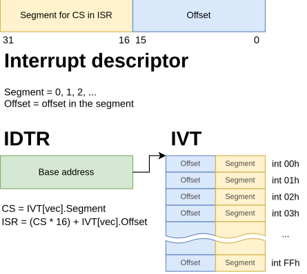
</p>

You can find more in the CPU specs:
* [Intel Software Developer's Manual](https://www.intel.com/content/www/us/en/developer/articles/technical/intel-sdm.html),
  Volume 2 Instruction Set Reference, Chapter 3, 3.3 INT n/INTO/INT3/INT1, "With IDT Event Delivery".
* [AMD Architecture Programmer's Manual](https://docs.amd.com/search/all?query=architecture+programmer%27s+manual&content-lang=en-US),
  Volume 2, Chapter 8 Exceptions and Interrupts, 8.6 Real-Mode Interrupt Control Transfer.

There are some kinds of interrupts:
* Software-generated by the `int N` instruction: it directly calls a handler in IVT by the specified vector.
* External: these are generated by hardware and delivered to the CPU via interrupt controllers like PIC, APIC or x2APIC.
* Exceptions.

An interrupt handler is called **ISR**: **Interrupt Service Routine**.  
In ISR, you have to save anywhere the current CPU state, perform handling,
restore the CPU state and return to the interrupted code from the interrupt
via the `iret` instruction.

```x86asm
IVT_ENTRY_SIZE = 4

; Register our ISR for the interrupt vector 255:
mov word ptr [0xFF * IVT_ENTRY_SIZE + 0], offset our_isr  ; Offset relative to the base segment.
mov word ptr [0xFF * IVT_ENTRY_SIZE + 2], 0               ; Base segment of the ISR

; Call our ISR via a software interrupt:
int 0xFF

...

our_isr:
    pusha  ; Save the CPU state on the current stack.
    
    ; ... Handle the interrupt ...
    
    popa   ; Restore the CPU state.
    iret   ; Return to the interrupted code.
```

There first 32 interrupts are reserved for the CPU-generated exceptions and NMI:

| Vector   | Mnemonic  | Description                               |
| -------- | --------- | ----------------------------------------- |
| 0        | #DE       | Divide by zero                            |
| 1        | #DB       | Debug exception                           |
| 2        |           | NMI (Non-Maskable Interrupt)              |
| 3        | #BP       | Breakpoint (INT3)                         |
| 4        | #OF       | Overflow (INTO)                           |
| 5        | #BR       | BOUND range exceeded                      |
| 6        | #UD       | Undefined opcode                          |
| 7        | #NM       | No math coprocessor                       |
| 8        | #DF       | Double fault                              |
| 9        |           | Coprocessor segment overrun               |
| 10       | #TS       | Invalid TSS                               |
| 11       | #NP       | Segment not present                       |
| 12       | #SS       | Stack-segment fault                       |
| 13       | #GP       | General protection                        |
| 14       | #PF       | Page fault                                |
| 15       |           | Reserved                                  |
| 16       | #MF       | x87 FPU floating-point error              |
| 17       | #AC       | Alignment check                           |
| 18       | #MC       | Machine check                             |
| 19       | #XM       | SIMD floating-point exception             |
| 20       | #VE       | EPT violation (Intel only)                |
| 21       | #CP       | Control protection exception              |
| 22       |           | Reserved                                  |
| 23       |           | Reserved                                  |
| 24       |           | Reserved                                  |
| 25       |           | Reserved                                  |
| 26       |           | Reserved                                  |
| 27       |           | Reserved                                  |
| 28       | #HV       | Hypervisor injection exception (AMD only) |
| 29       | #VC       | VMM communication exception (AMD only)    |
| 30       | #SX       | Security exception (AMD only)             |
| 31       |           | Reserved                                  |
| 32..255  |           | User-defined                              |

You can find this table here:
* [Intel Software Developer's Manual](https://www.intel.com/content/www/us/en/developer/articles/technical/intel-sdm.html),
  Volume 3 System Programming Guide, Chapter 7 Interrupt and Exception Handling, 7.3 Sources of Interrupts.
* [AMD Architecture Programmer's Manual](https://docs.amd.com/search/all?query=architecture+programmer%27s+manual&content-lang=en-US),
  Volume 2, Chapter 8 Exceptions and Interrupts, 8.2 Vectors.

### <a id="16-bit-bios"></a> BIOS

For interaction with the system, BIOS provides an interface
via interrupts: we can perform disk I/O or print something
onto a screen by issuing the certain interrupts via the `int XXh`
instruction with the arguments passed in registers.

Example:
```x86asm
; Writing a char to a screen via a BIOS interrupt.

mov ah, 0x0E    ; BIOS teletype function
mov al, 'A'     ; Character to print

mov bh, 0x00    ; Page 0
mov bl, 0x07    ; Set light gray on black

int 0x10        ; Call the BIOS video interrupt
```

You can treat these interrupts like an API of this tiny OS: in modern
Windows and Linux we have syscalls, in legacy BIOS there were interrupts.

| Vector   | Description                                  |
| -------- | -------------------------------------------- |
| 0        | Divide by zero                               |
| 1        | Debug exception (single step)                |
| 2        | NMI (Non-Maskable Interrupt)                 |
| 3        | Breakpoint (INT3)                            |
| 4        | Overflow (INTO)                              |
| 5        | Print screen                                 |
| 6        |                                              |
| 7        |                                              |
| 8        | System timer                                 |
| 9        | Keyboard                                     |
| 10..13   |                                              |
| 14       | Diskette                                     |
| 15       |                                              |
| 16       | Video                                        |
| 17       | Equipment determination                      |
| 18       | Memory size determination                    |
| 19       | Fixed disk/diskette                          |
| 20       | Asynchronous communications                  |
| 21       | System services                              |
| 22       | Keyboard                                     |
| 23       | Printer                                      |
| 24       | Resident BASIC                               |
| 25       | Bootstrap loader                             |
| 26       | System timer and Real-Time Clock Services    |
| 27       | Keyboard break                               |
| 28       | User timer tick                              |
| 29       | Video parameters                             |
| 30       | Diskette parameters                          |
| 31       | Video graphics characters                    |
| 32..63   | Reserved for DOS                             |
| 64       | Diskette BIOS revector                       |
| 65       | Fixed disk parameters                        |
| 66..69   |                                              |
| 70       | Fixed disk parameters                        |
| 70..73   |                                              |
| 74       | User alarm                                   |
| 75..95   |                                              |
| 96..103  | Reserved for user program interrupts         |
| 104..111 |                                              |
| 112      | Real-Time Clock                              |
| 113..116 | User alarm                                   |
| 117      | Redirect to NMI interrupt                    |
| 118..127 |                                              |
| 128..133 | Reserved for BASIC                           |
| 134..240 | Used by BASIC interpreter when running BASIC |
| 241..255 | Reserved for user program interrupts         |

Here you can find the detailed description for all of them:
* [IBM PS/2 and BIOS Interface Technical Reference](https://archive.org/details/bitsavers_ibmpcps2PSTechnicalReferenceApr87_5816663) -
  the whole this spec is about BIOS interrupts.

#### <a id="16-bit-why-interrupts"></a> Why interrupts?

It's just a simple way to call a function without knowing its real address.  
We just have some "magic" numbers assigned to the certain BIOS functions
that were introduced and standartized by IBM developers in their BIOS in
the past, and all IBM-compatible PCs with their BIOSes still had to support them.

> The term "IBM-compatible" literally means that the PC
> has the same BIOS interrupts, IO-ports and memory layout
> as any IBM computer from 80s.  
> This allowed programs of those years to be portable between IBM and Intel PCs.

In our days, we think about BIOS just like about a UI to tweak our
hardware, no more, but it was actually an OS with its own API that
simplified interaction with the system for user programs.

BIOS creates its own interrupt vector table (IVT) with its own handlers
for the required interrupts, and their indices keep stable across years
since 80s.

#### <a id="16-bit-interrupt-overlapping"></a> Interrupt overlapping

You might have noticed that the first 32 vectors are reserved in the CPU
for its own exceptions, but the BIOS defines its functions starting at the 8th,
so many of interrupts overlap.  
For example, the interrupt `0x10` is reserved for x87 FPU error in the CPU,
and, at the same time, it is defined in BIOS as a Video interrupt to deal with VGA.

That happened because in the years when the BIOS interrupts were introduced and assigned
to their current vectors, the 8086 processor had only 5 interrupts.  
But when new interrupts were introduced in the later CPUs, the interrupts began to overlap
the BIOS standard interrupts.  
This was a consequence of IBM's shortsightedness.

Fortunately, the most of new interrupts were introduced for x87 and Protected Mode.  
The CPU-generated interrupts for x87 are enabled manually in `CR0.NE` (Numeric Error) and are disabled by default.  
In such case, the FPU exceptions are delivered through an external interrupt `IRQ13` via PIC - see the chapter ["External interrupts"](#16-bit-external-interrupts) for details.
And those of interrupts that are for Protected Mode cannot arrive in Real Mode at all.

So, while you're in Real Mode, you deal with the BIOS interrupts, and the CPU
can't raise the exceptions the meaning of which differs from the BIOS handlers.

### <a id="16-bit-vga"></a> VGA

In older PCs the only way to interact with a screen was a VGA-framebuffer
that was mapped into a physical address space of a CPU.  

VGA has two modes:
* **Text mode** - acts like a text console: a display is divided into
  cells of chars with the specified colors.  
  Its memory mapping starts at `0xB8000`.  
  Each cell on a screen is described by two bytes: a byte for a character and
  a byte for the character and background colors.
* **Video mode** - acts like a drawable canvas: we can set colors for each pixel on it.  
  Its memory starts at `0xA0000`.  
  Each pixel is represented by the single byte that's an index in a palette.

You can switch video modes via `int 10h`: it's an interrupt in BIOS standartized by IBM
to interact with VGA.

You can find more about VGA here:
* [IBM PS/2 and BIOS Interface Technical Reference](https://archive.org/details/bitsavers_ibmpcps2PSTechnicalReferenceApr87_5816663) -
  for the VGA-related commands (interrupts) in BIOS.
* [IBM VGA XGA Technical Reference Manual](https://archive.org/details/bitsavers_ibmpccardseferenceManualMay92_1756350/page/n3/mode/2up) -
  specification for the VGA controller.
* [Text UI on wiki.osdev.org](https://wiki.osdev.org/Text_UI) - for simple console output (text mode).
* [VGA hardware on wiki.osdev.org](https://wiki.osdev.org/VGA_Hardware) - for advanced programming of VGA hardware.

We're interested in the text mode as it doesn't require additional setup.  
In this mode, by default, we have a console of 80x25 cells.

The framebuffer for this mode is located at `0xB8000` and
has a size of `80*25*2 = 4000` bytes.

Each cell consists of 2 bytes: the first byte is a character, and the second one
contains colors for the character (the lower 4 bits) and background (the higher 4 bits).

<p align="center">
  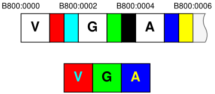
</p>

Example:
```x86asm
BLUE = 1
RED  = 4
CHAR_COLOR = 8   ; Bit shift
BACK_COLOR = 12  ; Bit shift

; Place blue 'A' on a red background at the first cell of a console:
mov ax, 0xB8000 / 16
mov es, ax
mov word ptr es:[0x00], 'A' | (BLUE << CHAR_COLOR) | (RED << BACK_COLOR)
```

### <a id="16-bit-chipset"></a> Chipset, Hardware & Peripherals

A CPU can't work in "spheric vacuum": it requires some environment
to deal with external devices like a screen, keyboard, printer or
anything else.  
All these devices do not connect to the CPU directly: they're
managed by a chipset. It's a bunch of controllers that wire
all these devices into an interface that the processor understands.

The most important parts of chipsets of those years were several controllers:
* [Intel 8042 Datasheet](https://theretroweb.com/chips/558) - Keyboard controller.  
  It managed not only a keyboard, but also some memory-related features like A20-line.
* [Intel 8254 Datasheet](https://www.alldatasheet.com/datasheet-pdf/pdf/66099/INTEL/8254.html) - Programmable Interval Timer (PIT).  
  Just a timer that can be programmed to interrupt the CPU once in a given interval.  
  One of its outputs could be directed to a PC speaker: that allows us to play sounds.  
* [Intel 8259A Datasheet](https://www.alldatasheet.com/datasheet-pdf/pdf/66107/INTEL/8259A.html) - Programmable Interrupt Controller (PIC).  
  The heart of signaling: it unites all devices connected to it into a single interface,
  allowing them to notify the CPU about certain events.  
  Both the keyboard controller and the timer (and many other devices like COM-ports) are connected to it.

The system has four ways of interacting with hardware:
* Port-mapped I/O (PMIO), also known as just I/O-ports.
* Memory-mapped I/O (MMIO).
* Device-initiated external interrupts.
* Direct Memory Access (DMA) as a transport.

We'll consider only I/O-ports and external interrupts here.

### <a id="16-bit-io-ports"></a> I/O Ports

It is a legacy interface for sending and receiving small portions
of data to or from hardware.

Physically it is a dedicated bus in a chipset that wires the
exact lines in a CPU with the exact lines in hardware.  
Each I/O-port corresponds to an according address on this bus.

In CPU, there are two dedicated instructions to deal with these ports: `in` and `out`:
* `in` - read something from the specified port.
* `out` - write something to the specified port.

You can find a list of I/O-ports, their purpose and the data
they work with in the specification for your chipset:
* [Intel Platform Controller Hub (PCH)](https://www.intel.com/content/www/us/en/search.html#q=platform%20controller%20hub&cf-tabfilter=Developers) - for Intel chipsets.
* [AMD Processor Programming Reference](https://docs.amd.com/search/all?query=processor+programming+reference&content-lang=en-US) - for AMD chipsets.

It's quite difficult to find definitions for legacy I/O ports there,
but I'll give you some recommendations.

For Intel:
* In the Volume 1, go to **Memory Mapping** → **Functional Description** →
  **Fixed I/O Address Ranges** → Look for the third column, **Internal Unit**.  
  For example **RTC** for `70h` or **8254 Timer** for `50h`.
* Then, in the Volume 2, select the chapter of the required target.

  **Note:** there is no one-by-one matching between units and chapters.  
  Like, for `60h` in the Volume 1, there is no dedicated chapter
  for the legacy keyboard controller.  
  All we have are some references in the **eSPI** chapter without specifics for this port.

For AMD:
* Go to the **Fusion Control Hub (FCH)** volume → **Registers** →
  **Legacy Block Configuration Registers (IO)** → **Registers** →
  Look for `LEGACYIO`.

Unfortunately, these specifications are very confusing, as if they
are for internal usage and for those who already familiar with this.  
If you can help me with understanding of how to deal with these specifications,
please write to me, and I'll clarify it in this article.

Also, there is a community-driven list of I/O ports:
* [I/O Ports on **wiki.osdev.org**](https://wiki.osdev.org/I/O_Ports)

Anyway, the most ports are vendor-specific and may differ from chipset to chipset.  

But there are a bunch of ports **standartized** by IBM in 80s: any IBM-compatible PC
have to support these ports.  
And these ports are very well documented in old IBM specifications:
* [IBM PC/AT Techical Reference](https://bitsavers.trailing-edge.com/pdf/ibm/pc/at/)
* [IBM VGA XGA Technical Reference Manual](https://archive.org/details/bitsavers_ibmpccardseferenceManualMay92_1756350/page/n3/mode/2up)

They have definitions for IBM-standartized ports wired to legacy hardware
that is still emulated by chipsets in modern PCs:
* **RTC** - Real-Time Clock.
* **Intel 8042** - Keyboard Controller.
* **Intel 8254** - Programmable Interval Timer.
* **Intel 8259A** - Programmable Interrupt Controller.
* **VGA** - Graphics adapter.

There is no comprehensive listing for I/O-ports, but you can find the corresponding ports
for each device in the corresponding chapters.  
So, you should ask not "which actions are performed by these ports", but
"which ports are dedicated for this device".

The IBM-standartized port numbers are came out from thin air: IBM just wired
them such in their computer many years ago, and that became a standard.

### <a id="16-bit-external-interrupts"></a> External interrupts

I/O ports from the previous chapter is a CPU-initiated transport
that can trigger something in hardware.  
But what if the hardware needs to notify the CPU?

In such case, the hardware can send an external interrupt to the processor.  
There is a dedicated unit in the system that manages such interrupts:
it's called **Programmable Interrupt Controller**, or just **PIC**.  
Physically it was implemented in the dedicated **Intel 8259A** chip, but in
modern PCs it is completely emulated by the chipset.

PIC is legacy hardware: in modern systems it was superseded by
APIC and then x2APIC - the completely different way to handle
interrupts, much more flexible and performant.

We'll consider only legacy PIC here.

PIC is an intermediate layer between the CPU and peripheral devices:
it aggregates external interrupts and sends them to the CPU in a
consistent manner, dedicating independent IRQ lines for each device.

It consists of two controllers: **Master PIC** and **Slave PIC**.  
Each of them handles 8 external interrupts: `IRQ0..IRQ7` for **Master PIC**,
and `IRQ8..IRQ15` for **Slave PIC**.  
Each IRQ maps into its own handler in an OS-defined interrupt vector table (IVT).

Slave PIC is wired to IRQ2 slot of Master PIC making a cascade.

<p align="center">
  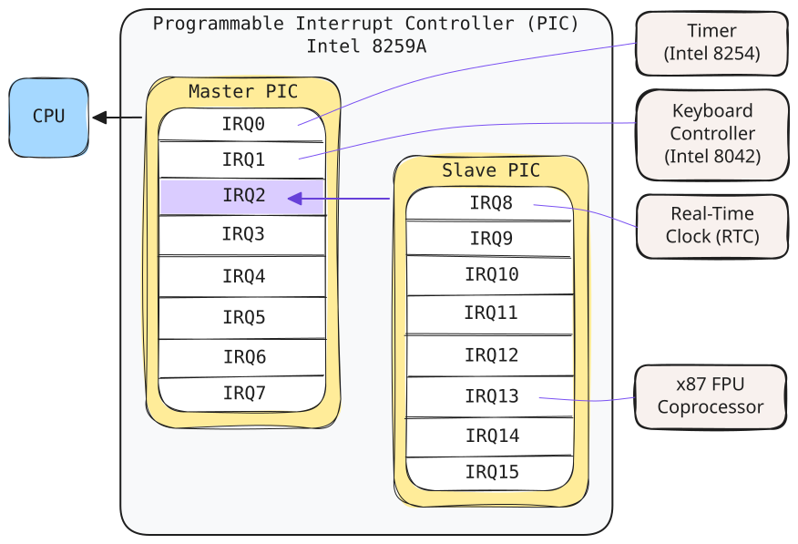
</p>

PIC doesn't know anything about the devices that are connected to it: it's
just a controller to manage interrupts, no more.  
But IBM **standartized** their wiring of devices to PIC in their IBM PC,
so even modern PCs have to follow this convention.

You can find this wiring here:
* [IBM PC/AT Techical Reference](https://bitsavers.trailing-edge.com/pdf/ibm/pc/at/) - System Board, 1-13, Hardware Interrupt Listing.

The most common IRQ-to-device bindings are:
* `IRQ0` - **Timer** channel 0 from Programmable Interval Timer (PIT, Intel 8254).
* `IRQ1` - **Keyboard controller** (Intel 8042), signals that the port `0x60` is ready for reading a scancode.
* `IRQ2` - **Slave PIC** interrupts (`IRQ8..IRQ15`) are coming from this IRQ.
* `IRQ8` - **Real-Time Clock** (RTC).

By default, PIC IRQs are bound to the following interrupt numbers in Interrupt Vector Table:
|   PIC  |      IRQs     | Interrupt number in IVT |
| ------ | ------------- | ----------------------- |
| Master | `IRQ0..IRQ7`  | `8..15 (0x08..0x0F)`    |
| Slave  | `IRQ8..IRQ15` | `112..119 (0x7A..0x77)` |

You can manage PIC via reprogramming it through its I/O interface.  
The most common tasks you may want to do are:
* Mask some interrupts to disable arriving of them.
* Remap interrupts to another interrupt numbers in Interrupt Vector Table.

All of these are performed through initiating a reprogramming I/O-sequence.  
PIC is programmed via 3 or, optionally, 4 so-called "Initialization Command Words", or, shorter, ICWs.  
Each PIC (Master and Slave) are programmed independently.  

You can find the definition of the ICWs and an order of them in the specification for Intel 8259A:
* [Intel 8259A Datasheet](https://www.alldatasheet.com/datasheet-pdf/pdf/66107/INTEL/8259A.html)

To send these commands to PIC, there are dedicated ports for it:
* `0x20` and `0x21` for Master PIC.
* `0xA0` and `0xA1` for Slave PIC.

You can find these ports in Intel and AMD chipset specs:
* [Intel Platform Controller Hub (PCH)](https://www.intel.com/content/www/us/en/search.html#q=platform%20controller%20hub&cf-tabfilter=Developers),
  Volume 2, 30 Interrupt, 30.1 Interrupt Registers Summary.
* [AMD Processor Programming Reference](https://docs.amd.com/search/all?query=processor+programming+reference&content-lang=en-US),
  look for `INTRCNTRL1REG1`, `INTRCNTRL1REG2`, `INTRCNTRL2REG1` and `INTRCNTRL2REG2`.

Also, you can read about PIC on **wiki.osdev.com**:
* [8259 PIC](https://wiki.osdev.org/8259_PIC)

After handling of an interrupt, you should tell PIC that
it can deliver us the next interrupt.  
For this, you should send the **EOI**-command: **End-of-Interrupt**.

**EOI** is a part of **OCW2**: **Operational Command Word**.  
You can find about OCWs in the same docs.

```x86asm
your_isr:
    pusha

    ; ... Handling of the interrupt ...

    ; Tell PIC that we're ready to get the next interrupt:
    mov al, 0x20  ; 0x20 is MOCW2 with "Rotate and EOI Codes" set to 0b001.
    out 0x20, al  ; Send it to Master PIC.
    
    popa
    iret
```

### <a id="16-bit-timer"></a> Timer

The timer is officially called **Programmable Interrupt Timer** or **PIT**.  
It is implemented in an **Intel 8254** chip and is controlled via I/O ports.

You can find the details here:
* [Intel 8254 Datasheet](https://www.alldatasheet.com/datasheet-pdf/pdf/66099/INTEL/8254.html)
* [PIT on **wiki.osdev.org**](https://wiki.osdev.org/Programmable_Interval_Timer)

It has 3 channels that can can be programmed independently:
* **Channel 0** - is connected to PIC (Programmable Interrupt Controller) and triggers `IRQ0` on each tick.
* **Channel 1** - was used for refreshing DRAM cells, but is no longer used.
* **Channel 2** - is connected to a PC speaker.

And it has an oscillator that ticks at 1.193182 MHz,
and we can set dividers of this frequency for each
channel independently.  
As the divider is a 16-bit integer, we can get the
following frequencies:
* Max is **1.19 MHz** for the divider `0x0001`.
* Min is **18.2 Hz** for the divider `0xFFFF`.

So, to tick at 1 kHz (once a millisecond), we have to set the divider `1193` or `0x4A9` in hex.

The timer is connected to the following I/O ports of the CPU:
* `0x40` - **Channel 1** data port, read-write.
* `0x41` - **Channel 2** data port, read-write.
* `0x42` - **Channel 3** data port, read-write.
* `0x43` - **Mode/Command register**, write-only.

These ports are documented in the chipset specs:
* [Intel Platform Controller Hub (PCH)](https://www.intel.com/content/www/us/en/search.html#q=platform%20controller%20hub&cf-tabfilter=Developers)  
  Volume 2, 24 8254 Timer.
* [AMD Processor Programming Reference](https://docs.amd.com/search/all?query=processor+programming+reference&content-lang=en-US)  
  11 Fusion Control Hub (FCH), 11.3 Registers, 11.3.1 Legacy Block Configuration Registers (IO),
  11.3.1.1 Registers.
  * `LEGACYIOx00000040 (FCH::IO::TIMERCH0)`
  * `LEGACYIOx00000041 (FCH::IO::TIMERCH1)`
  * `LEGACYIOx00000042 (FCH::IO::TIMERCH2)`
  * `LEGACYIOx00000043 (FCH::IO::TMR1CNTRLWORD)`

In order to program a channel, we have to write a command word into `0x43`,
and then write the divisor to a port of the corresponding channel. 

As stated on **wiki.osdev.org**, the Mode/Command registers contain the following:
```
Bits         Usage
7 and 6      Select channel :
                0 0 = Channel 0
                0 1 = Channel 1
                1 0 = Channel 2
                1 1 = Read-back command (8254 only)
5 and 4      Access mode :
                0 0 = Latch count value command
                0 1 = Access mode: lobyte only
                1 0 = Access mode: hibyte only
                1 1 = Access mode: lobyte/hibyte
3 to 1       Operating mode :
                0 0 0 = Mode 0 (interrupt on terminal count)
                0 0 1 = Mode 1 (hardware re-triggerable one-shot)
                0 1 0 = Mode 2 (rate generator)
                0 1 1 = Mode 3 (square wave generator)
                1 0 0 = Mode 4 (software triggered strobe)
                1 0 1 = Mode 5 (hardware triggered strobe)
                1 1 0 = Mode 2 (rate generator, same as 010b)
                1 1 1 = Mode 3 (square wave generator, same as 011b)
0            BCD/Binary mode: 0 = 16-bit binary, 1 = four-digit BCD
```

We're interested in **Channel 0** as it is the only channel wired to PIC thus is able to generate interrupts.

Let's set a 1 kHz timer that will trigger `IRQ0` each millisecond:
```x86asm
;
; Setup the ISR for IRQ0 (it is connected to Channel 0 of PIT).
;
; Note: such interrupt handling is valid for Real Mode only.
; In Protected Mode you should set an IDT descriptor for the remapped IRQ0.
;

IVT_ENTRY_SIZE = 4
IRQ0_VECTOR = 8  ; The default vector until we remap it to something else.
IRQ0_IVT_OFFSET = IRQ0_VECTOR * IVT_ENTRY_SIZE

mov word ptr [IRQ0_IVT_OFFSET + 0], offset irq0_isr
mov word ptr [IRQ0_IVT_OFFSET + 2], 0

;
; Setup the timer via programming Channel 0 of PIT.
;

mov al, 0b00110100  ; 16-bit divider, rate generator, lobyte/hibyte for Channel 0.
out 0x43, al
    
mov al, 0xA9  ; Low part of the divider (0x4A9 & 0xFF).
out 0x40, al  ; ...to Channel 0

mov al, 0x04  ; High part of the divider (0x4A9 >> 8).
out 0x40, al  ; ...to Channel 0

;
; ... Do something ...
;

;
; Handler for IRQ0.
;
irq0_isr:
    pusha

    ; ... Handle a tick ...

    ;
    ; As IRQ0 is a PIC-initiated interrupt,
    ; we have to tell PIC that we're done via
    ; sending the EOI (End-of-Interrupt) operational
    ; command to Master PIC (as IRQ0 is came from it).
    ;
    mov al, 0x20  ; 0x20 is MOCW2 with "Rotate and EOI Codes" set to 0b001.
    out 0x20, al  ; Send it to Master PIC.

    popa
    iret
```

You can find more about handling of interrupts in the corresponding chapter ["Interrupts"](#16-bit-interrupts).

### <a id="16-bit-keyboard"></a> Keyboard

For handling of PS/2 keyboard and mouse, in the older days there was a dedicated chip **Intel 8042 (Universal Peripheral Interface)**.  
Due to its rich GPIO facilities, this chip was used not only for input handling,
but also for controlling the A20 address line and for system reset: that was done
just to reduce the cost of production.  
In modern computers, this chip is completely emulated by a chipset that supports
PS/2 emulation in order to provide a bridge between modern USB devices and legacy OSes.

You can find the hardware-related details here:
* [Intel 8042 Datasheet](https://theretroweb.com/chips/558)
* [I8042 PS/2 Controller on **wiki.osdev.org**](https://wiki.osdev.org/I8042_PS/2_Controller)

In modern chipsets there is no more this controller, but
it is still emulated for the backward compatibility.  
There is no information about handling of legacy keyboards
in the modern chipset specs, but you can find some breadcrumbs here:
* [Intel Platform Controller Hub (PCH)](https://www.intel.com/content/www/us/en/search.html#q=platform%20controller%20hub&cf-tabfilter=Developers)  
  * Volume 1, 3.0 Memory Mapping, 3.1.2 Fixed I/O Address Ranges.
  * Volume 1, 15.0 Enhanced Serial Peripheral Interface (eSPI).
  * Volume 2, 2 Enhanced SPI Interface (D32:F0), 2.1 eSPI PCI Configuration Registers Summary, 2.1.11 USB Legacy Keyboard/Mouse Control (ESPI_ULKMC) - Offset 94h.
* [AMD Processor Programming Reference](https://docs.amd.com/search/all?query=processor+programming+reference&content-lang=en-US)
  * 11.3 Registers, 11.3.1 Legacy Block Configuration Registers (IO), 11.3.1.1 Registers:
    * `LEGACYIOx00000060 (FCH::IO::IO_PORT_60)`
    * `LEGACYIOx00000064 (FCH::IO::IO_PORT_64)`

It is connected to `IRQ1` of Master PIC that is fired each time you make a key press.  
Through this interrupt it tells us that the keyboard input buffer is filled and
we can read a scancode of the pressed key from the port `0x60`.

<p align="center">
  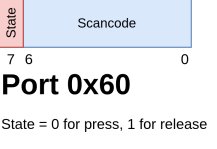
</p>

The usage details are documented here:
* [IBM PC/AT Techical Reference](https://bitsavers.trailing-edge.com/pdf/ibm/pc/at/), 1-51 System Board, Output Buffer.
* [PS/2 Keyboard on **wiki.osdev.org**](https://wiki.osdev.org/PS/2_Keyboard)

In short, to receive key presses, all we need is to register a handler for `IRQ1` and read scancodes from the port `0x60`:
```x86asm
;
; Setup the ISR for IRQ1 that is connected to the PS/2 controller.
;
; Note: such interrupt handling is valid for Real Mode only.
; In Protected Mode you should set an IDT descriptor for the remapped IRQ0.
;

IVT_ENTRY_SIZE = 4
IRQ1_VECTOR = 9  ; The default vector until we remap it to something else.
IRQ1_IVT_OFFSET = IRQ1_VECTOR * IVT_ENTRY_SIZE

mov word ptr [IRQ1_IVT_OFFSET + 0], offset irq1_isr
mov word ptr [IRQ1_IVT_OFFSET + 2], 0

wait_for_input:
    hlt                  ; Wait for any interrupt.
    call input_handler
    jmp wait_for_input

input_handler:
    xor al, al
    xchg al, [0x7E00]    ; Take a scancode stored by a keyboard interrupt.
    
    test al, al          ; Leave if it wasn't a keyboard interrupt.
    jz leave_handler

    test al, 0b10000000  ; Leave if it's a key release.
    jnz leave_handler

    ; ... Handle a key press ...

leave_handler:
    ret

;
; Handler for IRQ1.
;
irq1_isr:
    pusha

    in al, 0x60       ; Read a scancode
    mov [0x7E00], al  ; Place it anywhere to handle it outside of an interrupt.

    ;
    ; As IRQ1 is a PIC-initiated interrupt,
    ; we have to tell PIC that we're done via
    ; sending the EOI (End-of-Interrupt) operational
    ; command to Master PIC (as IRQ1 is came from it).
    ;
    mov al, 0x20  ; 0x20 is MOCW2 with "Rotate and EOI Codes" set to 0b001.
    out 0x20, al  ; Send it to Master PIC.

    popa
    iret
```

## <a id="tldr"></a> 🥱 Too long, didn't read. Let's code!
**[Ah, yes, you're finally here!](https://www.youtube.com/watch?v=iKs7aBEHyTg&t=2829s)**

Yeah, I know, you're bored! :D  
But we can't just get it up and build things for 16-bit as Rust doesn't support it out of box.  
So, let's set up the environment!

As Rust is a cross-compiler, it supports compiling for any architecture.  
There is a possibility to define your own custom target via a specification for the desired platform.

### <a id="switch-to-nightly"></a> Switch to nightly

Building for custom targets requires nightly Rust.  
Install it via:
```console
rustup install nightly
```

Then, to use nightly in the project, create `rust-toolchain.toml` in the project root with the following content:
```toml
[toolchain]
channel = "nightly"
components = ["rust-src", "rust-std", "rustc", "cargo"]
```

### <a id="create-a-target-spec"></a> Create a target spec

The specification is a JSON with declarations for some platform-specific
considerations like a register size, pointer width, relocation model, etc.

You can find out more about it here:
* [Custom Targets on docs.rust-lang.org](https://doc.rust-lang.org/rustc/targets/custom.html)

You can use a specification for the current platform as a reference:
```console
$ rustc +nightly -Z unstable-options --print target-spec-json
```

The exact JSON-format may differ from version to version, so you should
consult with the schema:
```console
$ rustc +nightly -Z unstable-options --print target-spec-json-schema
```

For 16-bit it could be defined as:
```
{
  "llvm-target": "i386-unknown-none-code16",
  "target-pointer-width": 32,
  "data-layout": "e-m:e-p:32:32-p270:32:32-p271:32:32-p272:64:64-i128:128-f64:32:64-f80:32-n8:16:32-S128",
  "arch": "x86",
  "os": "none",
  "vendor": "unknown",
  "linker-flavor": "ld.lld",
  "requires-uwtable": false,
  "eh-frame-header": false,
  "relocation-model": "static",
  "frame-pointer": null
}
```

There are some crucial members:
* `llvm-target` - one of the targets supported by LLVM.  
  The only target suitable for 16-bit is `i386-unknown-none-code16`.  
  
  You can see the list of supported targets via:
  ```console
  $ rustc --print target-list
  ```

* `target-pointer-width` - we set 32 here as the Rust core library doesn't support
  widths other than 32 and 64: it will not compile if you set 16.  
  
  This means that all memory references in the generated code will be 32-bit.  
  There will be something like `mov [eax], 123` instead of `mov [ax], 123`.

* `relocation-model` - set `static` as our bootloader doesn't support relocations at all:
  the generated code will use absolute addresses.

* `data-layout` - WTF?! O_o  
  This defines the bitness of memory operations for all supported address spaces and data types.  
  
  Look for it in the LLVM docs:
  * https://llvm.org/docs/LangRef.html#data-layout

  The doc introduces the term "namespace": it's just a way of referencing memory.  
  For x86, LLVM defines many such ways:
  * Direct access like `mov [eax], 123` or `mov [0x123], eax`.
  * Access via the special segment offsets (`fs`, `gs` and `ss`) like `mov fs:0x10, eax`.
  * Microsoft-specific access in C/C++ via the pointer modifiers in MSVC:
    * [`__ptr32` and `__ptr64`](https://learn.microsoft.com/en-us/cpp/cpp/ptr32-ptr64?view=msvc-170)
    * [`__sptr` and `__uptr`](https://learn.microsoft.com/ru-ru/cpp/cpp/sptr-uptr?view=msvc-170)

  LLVM assigns unique identifiers for all of them.  
  For x86, you can see IDs of address spaces in the LLVM sources:
  * https://llvm.org/doxygen/namespacellvm_1_1X86AS.html

  In short, the string in the example above defines the following namespaces:
  * `p:32:32` - the default pointer operation is 32-bit (like `mov [eax], 123`).
  * `p270:32:32` - access via `void* __ptr32 __sptr` (signed 32-bit pointer).
  * `p271:32:32` - access via `void* __ptr32 __uptr` (unsigned 32-bit pointer.)
  * `p272:64:64` - access via `void* __ptr64` (64-bit pointer).
  
Save this JSON into `i8086-unknown-none.json` in the project root and create `.cargo/config.toml`:
```toml
[build]
target = "i8086-unknown-none.json"

[unstable]
build-std = ["core"]
json-target-spec = true
```

And you're good to go!

## <a id="first-light"></a> ☀️ First light

Let's write a tiny app that writes something onto the screen.

```console
$ cargo new hello16
```
Let's go!

### <a id="hello-16-bit-world"></a> Hello, 16-bit world!

In `Cargo.toml`, put the following:
```toml
[package]
name = "hello16"
version = "0.1.0"
edition = "2024"

[profile.dev]
panic = "abort"

[profile.release]
opt-level = "z"
panic = "abort"
strip = "debuginfo"
lto = false
debug = false
overflow-checks = false
debug-assertions = false
codegen-units = 1
```

Then, create the following files as stated in the previous chapter:
* `i8086-unknown-none.json`
* `.cargo/config.toml`

Then, write your code in `src/main.rs`:
```rust
#![no_std]
#![no_main]
#![warn(clippy::pedantic)]
 
core::arch::global_asm!(r#"
   .global _start
 
   _start:
       mov sp, 0x7C00  # Set up the stack
       call main
"#);
 
mod vga {
    pub const ADDR: *mut u16 = 0xB8000 as *mut u16;
    pub const WIDTH: usize = 80;
    pub const HEIGHT: usize = 25;

    pub fn fill(color: u8) {
        for i in 0..(WIDTH * HEIGHT) {
            unsafe {
                core::ptr::write_volatile(
                    ADDR.add(i),
                    u16::from(color) << 8
                );
            }
        }
    }
 
    pub fn draw(pos: usize, color: u8, sym: char) {
        unsafe {
            ADDR.add(pos).write_volatile(
                (u16::from(color) << 8) | u16::from(sym as u8)
            );
        }
    }
 
    pub fn text(pos: usize, color: u8, text: &str) {
        for (index, ch) in text.as_bytes().iter().enumerate() {
            self::draw(pos + index, color, *ch as char);
        }
    }
}
 
#[unsafe(no_mangle)]
extern "stdcall" fn main() -> ! {
    vga::fill(0x10);
    vga::text(vga::WIDTH + 1, 0x1E, "Hey, buddy, are you ready for rave?!");
 
    loop { core::arch::x86::_mm_pause(); }
}
 
#[panic_handler]
fn panic(_info: &core::panic::PanicInfo) -> ! {
    loop {}
}
```

### <a id="linker-script"></a> Linker script

Then, we need to tell a linker how to link that code onto a loadable bootsector.  
The linker must assume that the code will be placed at `0x7C00` to properly
calculate absolute addresses.  
The entry point `_start` must be placed at the beginning of our bootsector,
and the magic MBR signature `0xAA55` must be placed at the last two bytes of it.

We can achieve that by writing a linker script: the special file that defines
a memory layout of the final program.  
You can see more about linker scripts in the docs for **GNU ld**:
* https://ftp.gnu.org/old-gnu/Manuals/ld-2.9.1/html_chapter/ld_3.html#SEC6

Our linker script will be as follows:
```
ENTRY(_start)

SECTIONS {
    . = 0x500;
    _stack_start = .;

    . = 0x7c00;
    _stack_end = .;
    _mbr_start = .;

    .text :
    {
        *(.text .text.*)
    }
    .data :
    {
        *(.rodata .rodata.*)
        *(.data .data.*)
    }
    _mbr_end = .;

    . = 0x7c00 + 510;
    .magic_number :
    {
        SHORT(0xaa55)
    }

    . = 0x7E00;
    .data :
    {
        *(.got .got.*)
        *(.eh_*)
    }
}
```

We tell that the stack will be at `0x7C00` and will grow down to `0x500`:
it's the first conventional region that we're free to use for anything,
and it's good for stack.  

Then, there will be our bootsector from `0x7C00` to `0x7E00` (exactly 512 bytes)
with the signature `0xAA55` at the last two bytes of it.  
We place there code and data with explicit initializers.

And then there is the second conventional memory that we're going to
use for any uninitialized data (like `.bss` in terms of high-level executables).  
We place there any sections that have no explicit data or that contain
something that we wont to be included in our bootsector.

Place this script into `boot-sector.ld`, and then you have to tell the compiler
to use it while linking.

Create `build.rs`:
```rust
use std::path::Path;

fn main() {
    let local_path = Path::new(env!("CARGO_MANIFEST_DIR"));
    println!(
        "cargo:rustc-link-arg-bins=--script={}",
        local_path.join("boot-sector.ld").display()
    )
}
```

The `rustc` compiler will pass our linker-script to `lld` while linking.

### <a id="building-a-bootsector"></a> Building a bootsector

We're good to build a project:
```console
$ cargo build -Z json-target-spec --release
```

In `target/i8086-unknown-none/release`, we got the regular ELF file `hello16`.  
Now, we have to extract the bootsector from it.  
We can do that via `objcopy`:
```console
$ objcopy -I elf32-i386 -O binary ./target/i8086-unknown-none/release/hello16 ./bootsector
```
It will extract all sections that have initialized data (all that have the flag `SHF_ALLOC`)
into the raw file - that's our loadable bootsector that we can write into a bootable device.

### <a id="lock-and-load"></a> Lock and load!

We use QEMU to test our bootsector.  
Just use the file as a whole drive!
```console
$ qemu-system-x86_64 --drive format=raw,file=./bootsector
```

<p align="center">
  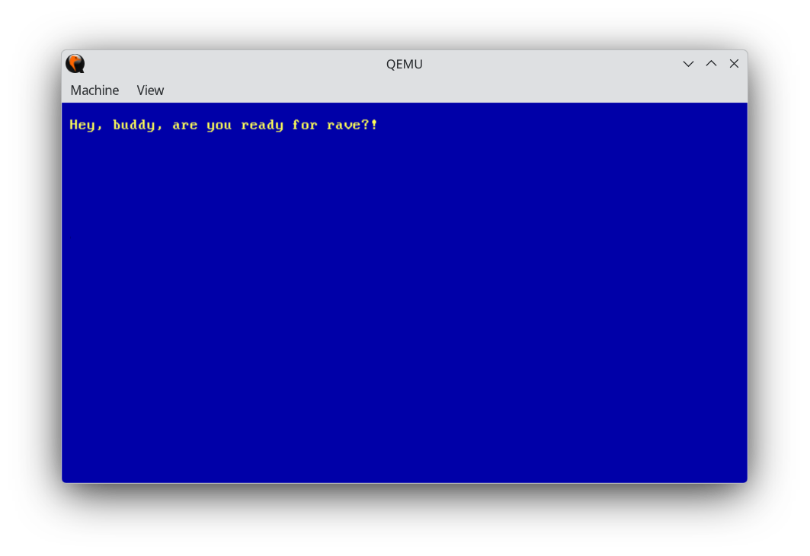
</p>

### <a id="whats-wrong"></a> What's wrong with that?

Let's examine our bootsector in IDA Pro.

<p align="center">
  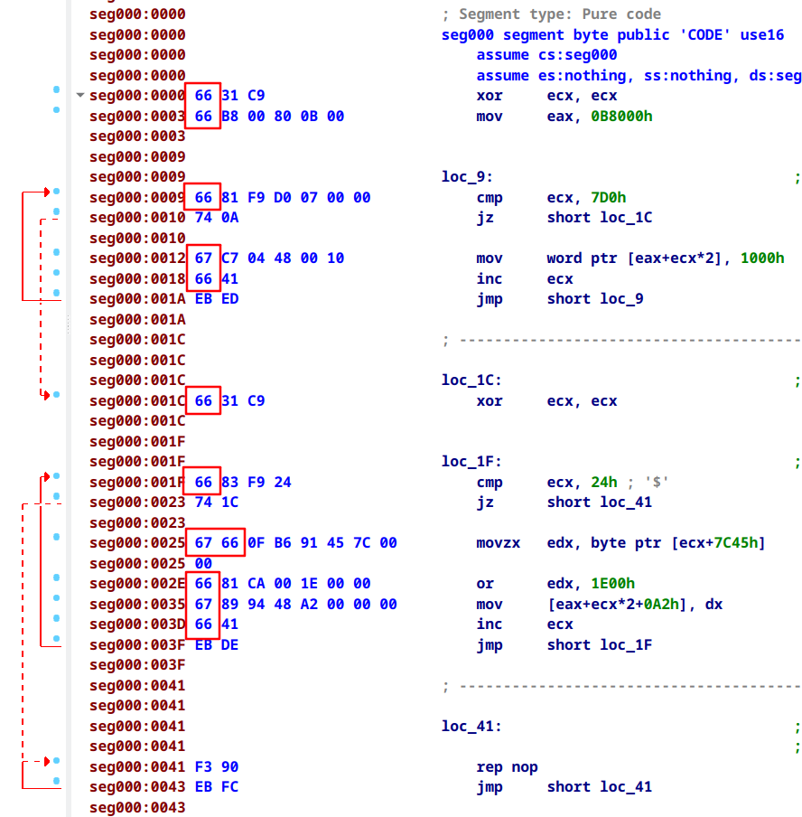
</p>

We see a lot of prefixes before almost each instruction:
* `0x66` - Operand-size override.
* `0x67` - Address-size override.

This is because LLVM doesn't generate true 16-bit code: it generates 32-bit instructions for 16-bit mode.  
It is achieved via prefixes that make native 16-bit instructions to work with 32-bit operands.

And this happens almost every instruction!

If we continue to write like this, these prefixes will eat up a lot of space,
and we just won't fit into 510 bytes!

How could we drop these prefixes?..  
**We can switch to Protected Mode!**

Indeed, we'll spend some bytes switching to Protected Mode,
but we will benefit from shorter instructions later!

The journey is just beginning! :D

## <a id="32-bit-protected-mode"></a> 🍃 32-bit Protected Mode

Well, this is a completely new mode that introduces many new concepts:
* Security rings.
* Descriptor tables for memory and interrupts.
* Memory paging (virtual memory).
* Hardware multitasking.
* 32-bit address space and native 32-bit instructions.
* And many other cool things...

<p align="center">
  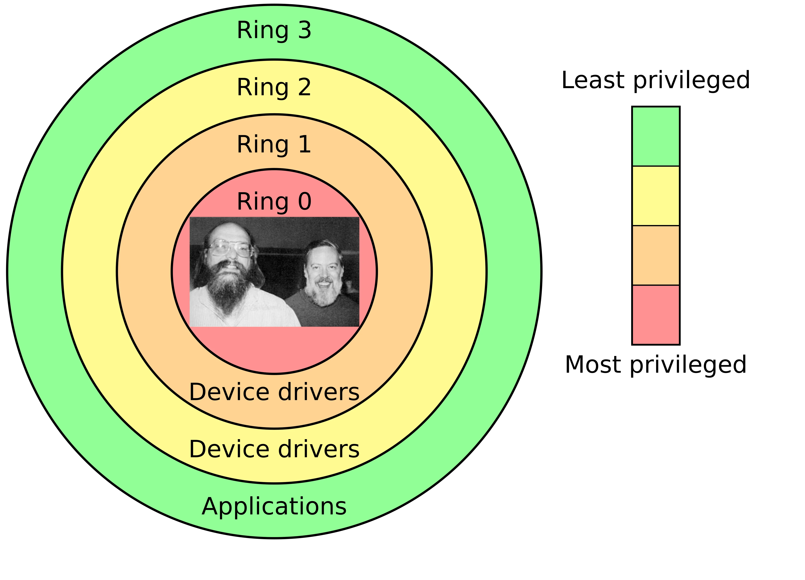
</p>

### <a id="32-bit-segments"></a> Segments & Descriptor tables

The whole address space is divided into segments with their own
base addresses, sizes and protection rights.  
Each segment is described by a record in the special descriptor table.  
There are two such tables: Global Descriptor Table (`GDT`) and
Local Descriptor Table (`LDT`).

The location and size of GDT and LDT is stored in the special registers: `gdtr` and `ldtr`.  
You can deal with these registers via the special instructions:
* `lgdt` - load (apply) new value of GDTR from the specified address.
* `sgdt` - store the current value of GDTR to the given memory location.
* `lldt` and `sldt` - the same (load and store), but for LDT.

<p align="center">
  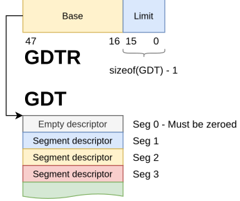
</p>

Global Descriptor Table is intended for describing global
system memory segments like kernel code and data.  
Local Descriptor Table is a per-task table describing
per-task segments like a virtual user address space
for a process.

Each segment specifies what this memory area is intended for:
code, data or stack (the special segment that grows down).  
In this model, each segment has its own access rights: read, write or execute.  
In addition, each code segment is associated with its own privilege level (or "ring"):
from Ring0 for the most trusted and privilege code to Ring3 for the less privileged user code.

<p align="center">
  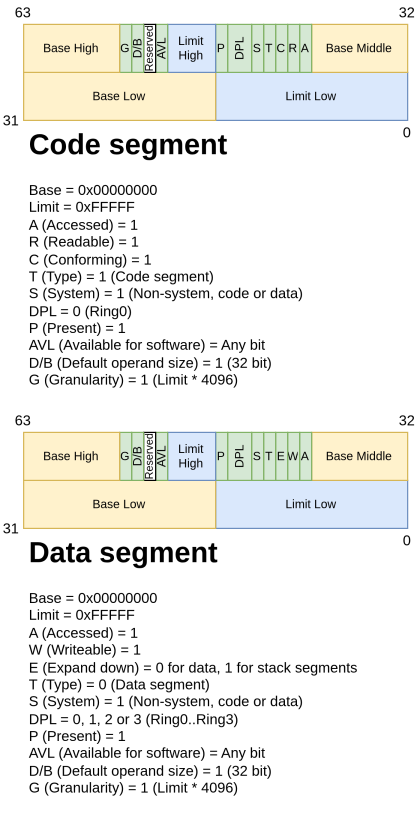
</p>

The purpose of the segment registers also changed: in Protected Mode, they
store an index (so-called "selector") of any segment descriptor in
one of the descriptor tables: either in `GDT` or in `LDT` depending on
their values.

<p align="center">
  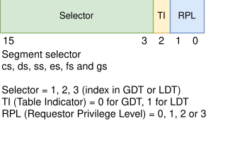
</p>

Then, the code can load the selector for the desired segment into
one of the segment registers and reference data through it:
```x86asm
mov fs, 16          ; Selector = 2, TI = 0, RPL = 0
mov fs:[0x10], eax  ; GDT[fs.Selector].Base + 0x10 = EAX
```

### <a id="32-bit-memory-model"></a> Memory model

Protected Mode introduced a concept of virtual memory and paging.

Now, the CPU doesn't work with physical addresses directly, but works
with virtual addresses that are translated into physical addresses
through translation tables.  
Each task on the processor can have its own translation tables, which
allows us to create isolated address spaces for each process.

Virtual address is not an "address" anymore: it's a set of indices
of entries in the translation tables. Each entry in each table refers
to the next translation level (to the next translation table) narrowing
the exact physical range to the exact physical address.

Each translation table consists of 512 entries: each entry contains
memory attributes like protection rights or cache types, and a physical
address of the beginning of the next translation table.

In Protected Mode, there are 2- and 3-level paging.  
The latter is called **PAE**: **Physical Address Extension**.

The tables are called:
* **Page-Directory Page Table** - describes 1 GiB regions, the single entry is called **PDPTE** in Intel terms or **PDPE** in AMD terms.
* **Page Directory Table** - describes 2 MiB regions (or large pages), the single entry is called **PDE**.
* **Page Table** - describes 4 KiB pages, the single entry is called **PTE**.

Depending on the entry flags, the translation could be stopped either at the last level (in **PTE**)
that gives us a regular 4 KiB page, or in the **PDE** that gives us so-called "large" 2 MiB page.

The beginning of the first translation table is stored in the
dedicated control register `cr3`.

Paging is enabled by setting the bit `CR0.PG`.

You can read about paging here:
* [Intel Software Developer's Manual](https://www.intel.com/content/www/us/en/developer/articles/technical/intel-sdm.html)  
  Volume 3 System Programming Guide, Chapter 5 Paging.
* [AMD Architecture Programmer's Manual](https://docs.amd.com/search/all?query=architecture+programmer%27s+manual&content-lang=en-US)  
  Volume 2, 5 Page Translation And Protection.

**We will not use paging in this project** as we don't have enough space
to setup page tables. We will not set `CR0.PG` and will continue to use
old addressing mode when all addresses are physical.

### <a id="32-bit-interrupts"></a> Interrupts

In Protected Mode, interrupt handling was completely redesigned.  

The CPU still uses a table of interrupt handlers, but now it's
called IDT: Interrupt Descriptor Table.  
This tables contains of 256 descriptors: each of them contains
a segment selector for ISR and an address of ISR relative to
the selected segment.

<p align="center">
  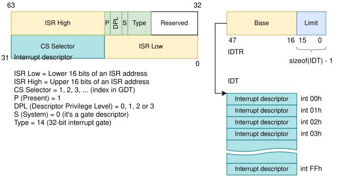
</p>

The first 32 interrupts (0..31) are **reserved** for the CPU exceptions.  
32..255 are free to use for external and software interrupts.

You can find the details here:
* [Intel Software Developer's Manual](https://www.intel.com/content/www/us/en/developer/articles/technical/intel-sdm.html)  
  Volume 3 System Programming Guide, Chapter 7 Interrupt and Exception Handling, 7.3 Sources of Interrupts.
* [AMD Architecture Programmer's Manual](https://docs.amd.com/search/all?query=architecture+programmer%27s+manual&content-lang=en-US)  
  Volume 2, Chapter 8 Exceptions and Interrupts, 8.2 Vectors.

### <a id="32-bit-external-interrupts"></a> External interrupts

We also have legacy PIC with the same 16 IRQs with the same handling as in 16-bit Real Mode.  
But there is one important thing.

As we remember, 8 IRQs from Master PIC (`IRQ0..IRQ7`) are mapped to the interrupt vectors 8..15.  
But these vectors are reserved for the CPU exceptions in Protected Mode.  
**There is no way to distinguish a CPU exception and an external interrupt in ISR.**

To prevent such confusion, we should engage IRQ remapping to move these IRQs
to another vectors: PIC supports remapping its IRQs via its reinitialization
through sending Initialization Command Words (**ICW**s) to its ports.

### <a id="32-bit-irq-remapping"></a> IRQ remapping

In the Real Mode chapters, we knew that PIC has the following ports for its reinitialization:
* `0x20` and `0x21` for Master PIC.
* `0xA0` and `0xA1` for Slave PIC.

These are defined in its specification:
* [Intel 8259A Datasheet](https://www.alldatasheet.com/datasheet-pdf/pdf/66107/INTEL/8259A.html)

We should issue a chain of 4 ICWs to reprogram Master PIC as its IRQs overlap with the CPU exceptions.
Slave PIC is already mapped to free vectors in IDT, so we don't need to change it.

There are 4 ICWs to perform remapping:
* `ICW1` - starts the sequence of ICW2, ICW3 and ICW4.
* `ICW2` - remaps IRQs to the desired vectors.
* `ICW3` - enables cascading Slave PIC via IRQ2 of Master PIC.
* `ICW4` - tell PIC that we're on an Intel-based system.

We have to send them all one by one:
* `ICW1` to the port `0x20`.
* `ICW2`, `ICW3`, `ICW4` to the port `0x21`.

```x86asm
mov al, ICW1
out 0x20, ax

mov al, ICW2
out 0x21, al

mov al, ICW3
out 0x21, al

mov al, ICW4
out 0x21, al
```

The complete example you can find:
* In our code in the current repo: [boot.s](./src/boot.s).
* In the [8259 PIC](https://wiki.osdev.org/8259_PIC) article on **wiki.osdev.org**.

### <a id="32-bit-switching-to-protected-mode"></a> Switching to Protected Mode

Enabling Protected Mode is quite easy:
1. Disable interrupts via the `cli` instruction.
2. Setup GDT.
3. Set the bit `CR0.PE` (**Protection Enable**) - this is the point where we actually switching the modes.
4. Perform a far jump into the 32-bit code segment that you just defined in your GDT.
5. Setup new 32-bit IDT.
6. Remap the interrupts of Master PIC to interrupt vectors greater than 31.
7. Re-enable interrupts via `sti`.

Switching to Proitected Mode is documented here:
* [Intel Software Developer's Manual](https://www.intel.com/content/www/us/en/developer/articles/technical/intel-sdm.html)  
  Volume 3 System Programming Guide, Chapter 12 Processor Management and Initialization, 12.9 Mode Switching.
* [AMD Architecture Programmer's Manual](https://docs.amd.com/search/all?query=architecture+programmer%27s+manual&content-lang=en-US)  
  Volume 2, 14 Processor Initialization and Long Mode Activation, 14.4 Initializaing Protected Mode.

**You could ask**: how even we can perform the step 4 after enabling Protected Mode?  
Like, you know, we are ALREADY in 32-bit mode, but that far jump is still a 16-bit instruction.

Great question!  
Actually, until that jump, we're still in 16-bit Real Mode as the CPU still
have the old value of the shadow part of CS that contains the value of the
selected segment.

That shadow part reloads every time you perform an intersegment transition.  
So, until you perform an intersegment jump or call, it will contain the previous
value for 16-bit Real Mode, and the CPU still executes 16-bit instructions.

It is stated in:
* [Intel Software Developer's Manual](https://www.intel.com/content/www/us/en/developer/articles/technical/intel-sdm.html)  
  Volume 3 System Programming Guide, Chapter 12 Processor Management and Initialization, 12.9 Mode Switching, 12.9.1 Switching to Protected Mode.
  
  > After entering protected mode, the segment registers continue to hold
  > the contents they had in real-address mode. The JMP or CALL instruction
  > in step 4 resets the CS register.

### <a id="32-bit-bios-that-we-lost"></a> BIOS that we lost

After switching to Protected Mode, we totally loose ability to
call BIOS functions as they're implemented in 16-bit code.  
Also, in Protected Mode we must recreate an interrupt table from scratch
since it now contains not pairs of `Segment:Offset`, but interrupt
descriptors.

Even if we recreate new IDT with the addresses from legacy IVT,
we can't directly call them as the encoding of 16-bit BIOS functions is
invalid in 32-bit mode.

**Now you're on your own.**

## <a id="what-about-snake"></a> 😴 ...But what about snake?..

Ha-ha, dude, I know :D  
Now we are **definitely** ready to write a snake!

> — Подумаешь, какой-то лох лёг в психбольницу!  
>   Сворачивать уже поздно, даже чисто из принципа!  
> [(Карандаш feat. Noize MC, "Hellp")](https://music.yandex.ru/album/989973/track/9352607)

We start at [boot.s](./src/boot.s): we define a 16-bit entry point
with the name `_start`.  
There, we disable VGA blinking and immediately enable Protected Mode.

We load the predefined GDT with two segments for code and data that
cover the whole 4 GiB address space.  
For interrupts, we create IDT on the fly with the exactly two
handlers - for `IRQ0` (timer) and `IRQ1` (keyboard).  
Then, we remap `IRQ0..IRQ7` to unused IDT vectors to
avoid overlapping with the CPU exceptions.  
Any other interrupt or exception will trigger a double-fault exception
as we don't define handlers for anything else, and the CPU will reset.

Then, we set a timer to tick once a millisecond to create
an event-loop of our game.  
And we register a keyboard ISR to catch an input.  
We will wait for the next tick and for a key press via the `hlt` instruction
that returns execution in case of arrival of any interrupt.

And we're good to call the Rust part!

There we implement the whole game logic: moving, keyboard handling,
eating and handling of collisions.  

We will store two points: the head and the tail positions.  
Each position will store a raw address of a VGA cell, and each
VGA cell will store the direction to the next cell in its character
part, while its color part will have the same colors for the char and
for the background to hide a junky char representation as it will store
some numbers, but not actual chars.

All of that you can find in [main.rs](./src/main.rs).

<p align="center">
  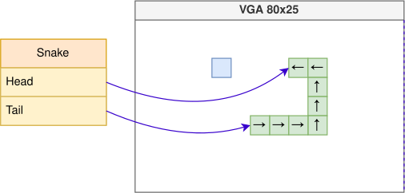
</p>

### <a id="remember-no-constants"></a> Remember - no constants

In such extreme constraints you're better follow some rules:
* Avoid constants as possible as they're eat a lot of space in instructions.  
* Prefer `xchg` for swapping: in Rust, you can achieve it either via atomics or via manual assembly.  
  `.replace()` or `.swap()` on non-atomic types will generate regular `mov`s.
* Prefer either 1-byte or native-size variables: don't use 16-bit variables in 32-bit mode and vice-versa
  as these instructions will require the special "override operand/memory size" prefixes (which we avoided
  by swithicng to Protected Mode).
* Perform math with operands of the same size, avoid typecasting as the instructions like `movzx` are quiet long.

### <a id="victory-costs"></a> Victory costs

[**Every time, we pay a little more.**](https://youtu.be/KlIbhWoqGDQ?si=2ThnH-WgtaP2Q1TL&t=118)

So, what do we get?

<p align="center">
  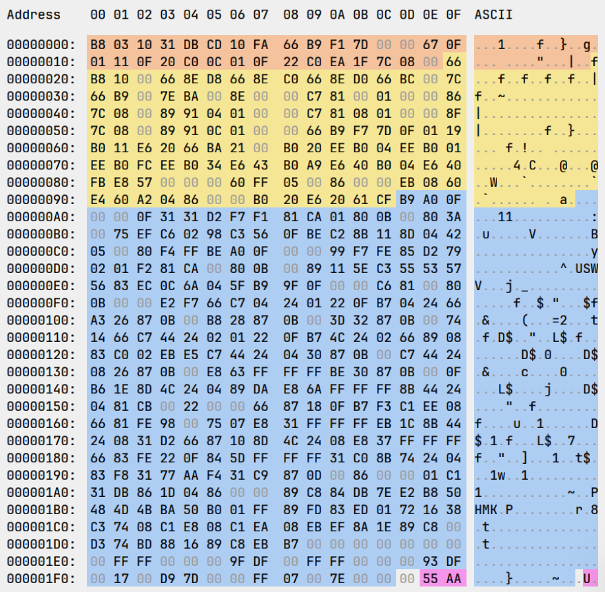
</p>

We've got a bootsector with the whole game size of the exactly 509 bytes:
* 31 bytes for the 16-bit Real Mode part that switches us into 32-bit Protected Mode.
* 126 bytes for the 32-bit part that set up GDT, IDT, PIC, remaps IRQs and calls the Rust part.
* 352 bytes for the Rust part with the game logic.

And we even have an empty byte for your wildest ideas! :D

**But what have we sacrificed?**

There is one thing: we were unable to implement correct horizontal teleportation due to out of space.  

Every time you hit the left or right corner, your snake appears from the opposite side
one cell higher or lower, depending on which wall you hit.  
For such teleportation we used the fact that the VGA memory is contiguous: so, we just add
an offset to a pointer to move the snake head left or right. And we don't care about left or right
corners: all we handle is the left upper and right bottom points and everything upper or
lower them.

## <a id="whats-next"></a> What's next?

Ya know, there is still a lot of space, so, here is the stuff that we will **definitely** implement:
* DLSS 5
* RTX-based ray tracing
* Screen-space ambient occlusion
* Global illumination
* Tesselation
* Liquid glass
* Loot boxes
* Battle passes
* Premium subscriptions
* Integrated AI chat

## <a id="afterwords"></a> Afterwords

Well, that was a great journey.  
Actually, we explored almost all osdev basics: from BIOS to Protected Mode.  
Despite of these things are outdated, the basics stay the same even in the
modern PCs with 64-bit UEFI.  
And, as a bonus, we got a legendary game in Rust that nobody made before in the whole world :3

So, I hope it was interesting for you.  
Love you, guys, and thanks for reading! ^^

<p align="center">
  
</p>